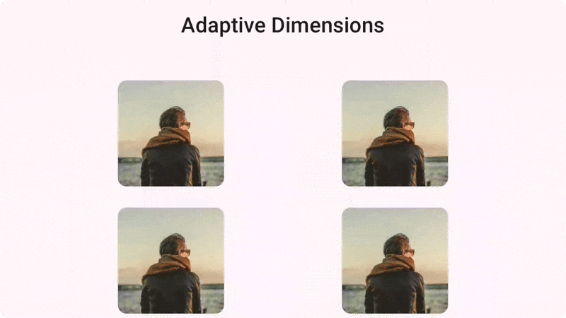

#  &nbsp; Adaptive Dimensions

<br>


This simple library can be used to help [Android](https://www.android.com/) and [Compose Multiplatform](https://www.jetbrains.com/lp/compose-multiplatform/)
application developers to create responsive layouts with the same design for every screen size by using two new structures, `AdaptiveDp` and `AdaptiveSp`.

<br>

<div align="center">
     
    &nbsp; &nbsp; &nbsp;
    
</div>
<br>
<div align="center">
    
    &nbsp; &nbsp; &nbsp;
    
</div>

<br>

## Feautures

- **Functionality**: Support for both Android Native and KMP development.
- **Compatibility**: Support for various devices, such as Smartphones, Tablets and Desktop.
- **Versatile**: Support for both portrait and landscape mode.
- **Lightweight**: Less than 5Mb size and depends only on Kotlin, Compose Fundamentals, Material and Size Unit.
- **Modern**: Made in Kotlin-first and interoperates with modern libraries including Compose, Material3 Adaptive and Dokka.

<br>

## Get started

<b>Step 1.</b> Add the JitPack repository to your `build.gradle` file, 
or to `settings.gradle` file if you using Gradle 7+
```gradle
repositories {
    ...
    maven { url 'https://jitpack.io' }
}
```
<br>

<b>Step 2.</b> Place this code to your `build.gradle` file and then sync the project:

```kotlin
dependencies {
    implementation("io.github.simone-tugnetti:adaptive-dimensions:1.0.0")
}
```

If you planning to use Compose Adaptive Dimensions, be sure to also include 
[Compose Material3 Adaptive](https://developer.android.com/jetpack/androidx/releases/compose-material3-adaptive) dependecy.

<br>

## Usages

Here you can find documentation on how to use this library by `Resources` and `Composables`.

<br>

### Table of contents
- [Resources](#resources)
    - [`@DimenRes`](#dimenres)
    - [`AdaptiveDp`](#adaptivedp)
    - [`AdaptiveSp`](#adaptivesp)
- [Compose](#compose)
    - [`CompositionLocalProviders`](#compositionlocalproviders)
        - [`AdaptiveDp`](#adaptivedp-1)
        - [`AdaptiveSp`](#adaptivesp-1)

<br>

#### Resources

You can use references to Adaptive Dimensional Resources in various ways, either through direct calls to @DimenRes, or by using the dedicated enum classes.<br>
All references are also grouped by dp values, called `adp`, and sp values, called `asp`.<br> 
For more info, check the [resources](adaptive-dimensions/src/main/java/it/simonetugnetti/adaptivedimensions/resources) package for structures or utils
and the [res](adaptive-dimensions/src/main/res) folder for dimensions.


##### [`@DimenRes`](adaptive-dimensions/src/main/res)

You can access the Adaptive Dimensional Resource directly by calling `R.dimen._Nadp` or `R.dimen._Nasp` 
and the corrisponding value changes by the device Smallest Screen Width, simple as that :wink:.<br>
You can also get the full list of `adp` and `asp` values by calling `R.array.adps` or `R.array.asps`.<br>

Call in XML View:

```xml
<TextView
    android:id="@+id/view_title"
    android:layout_width="match_parent"
    android:layout_height="wrap_content"
    android:layout_marginTop="@dimen/_12adp"
    android:text="Adaptive Dimensions"
    android:textSize="@dimen/_20asp" />
```

Or Programmatically:

```kotlin

// For single value
resources.getDimension(R.dimen._12adp)
resources.getDimensionPixelSize(R.dimen._18asp)
resources.getDimensionPixelOffset(R.dimen._22adp)

// For Lists
resources.obtainTypedArray(R.array.adps)
resources.obtainTypedArray(R.array.asps)

```


##### [`AdaptiveDp`](adaptive-dimensions/src/main/java/it/simonetugnetti/adaptivedimensions/resources/enums/AdaptiveDp.kt)

This `enum` class is used basically for access the `adp` @DimenRes resource by the corrisponding `entry`.
Here's some examples:

```kotlin

// By using Resources instance as Receiver
resources.getAdaptiveDpDimension(R.dimen._100adp.asAdaptiveDp())
resources.getAdaptiveDpDimension(AdaptiveDp._100adp)

// For obtaining a List of AdaptiveDp resources by Resources receiver
resources.getListOfAdaptiveDpDimenRes()

// By using AdaptiveDp enum as Receiver
AdaptiveDp._100adp.getDimension(resources)

// For obtaining a List of AdaptiveDp resources by his receiver
AdaptiveDp.listOfDimenRes()

```

For the full list of functions you can use, please check `AdaptiveDp` [enum](adaptive-dimensions/src/main/java/it/simonetugnetti/adaptivedimensions/resources/enums/AdaptiveDp.kt) 
and [utils](adaptive-dimensions/src/main/java/it/simonetugnetti/adaptivedimensions/resources/utils/AdaptiveDp.kt) files.


##### [`AdaptiveSp`](adaptive-dimensions/src/main/java/it/simonetugnetti/adaptivedimensions/resources/enums/AdaptiveSp.kt)

This `enum` class is used basically for access the `asp` @DimenRes resource by the corrisponding `entry`.
Here's some examples:

```kotlin

// By using Resources instance as Receiver
resources.getAdaptiveSpDimension(R.dimen._100asp.asAdaptiveSp())
resources.getAdaptiveSpDimension(AdaptiveSp._100asp)

// For obtaining a List of AdaptiveSp resources by Resources receiver
resources.getListOfAdaptiveSpDimenRes()

// By using AdaptiveSp enum as Receiver
AdaptiveSp._100adp.getDimension(resources)

// For obtaining a List of AdaptiveSp resources by his receiver
AdaptiveSp.listOfDimenRes()

```

For the full list of functions you can use, please check `AdaptiveSp` [enum](adaptive-dimensions/src/main/java/it/simonetugnetti/adaptivedimensions/resources/enums/AdaptiveSp.kt) 
and [utils](adaptive-dimensions/src/main/java/it/simonetugnetti/adaptivedimensions/resources/utils/AdaptiveSp.kt) files.

<br>

#### Compose

Unlike using [Resource](#resources) references, the Adaptive Compose version of this library uses [`Dp`](https://developer.android.com/reference/kotlin/androidx/compose/ui/unit/Dp) 
and [`TextUnit`](https://developer.android.com/reference/kotlin/androidx/compose/ui/unit/TextUnit) for specify unit sizes, 
stored in [`Adp`](adaptive-dimensions/src/main/java/it/simonetugnetti/adaptivedimensions/compose/model/Adp.kt) 
and [`Asp`](adaptive-dimensions/src/main/java/it/simonetugnetti/adaptivedimensions/compose/model/Asp.kt) data classes.<br>
It also use the last version of the official [Material3 Adaptive](https://developer.android.com/jetpack/androidx/releases/compose-material3-adaptive) 
library for retrieve at every re-composition the actual width, height, or 
[`WindowSizeClasses`](https://developer.android.com/develop/ui/compose/layouts/adaptive/use-window-size-classes) of device screen size.

For more info about the unit sizes based on device screen width, 
please check the Compose [`data`](adaptive-dimensions/src/main/java/it/simonetugnetti/adaptivedimensions/compose/data) package 
and the [`enums`](adaptive-dimensions/src/main/java/it/simonetugnetti/adaptivedimensions/compose/enums).

##### [`CompositionLocalProviders`](adaptive-dimensions/src/main/java/it/simonetugnetti/adaptivedimensions/compose/providers)

You can access for responsive size units by calling the `CompositionLocalProviders` for `AdaptiveDp`, based on `Dp` sizes, and `AdaptiveSp`, based on `TextUnit` sizes.

###### `AdaptiveDp`

You can use [`LocalAdp`](adaptive-dimensions/src/main/java/it/simonetugnetti/adaptivedimensions/compose/providers/dynamic/AdaptiveDp.kt), that use `compositionLocalOf`,
and [`LocalStaticAdp`](adaptive-dimensions/src/main/java/it/simonetugnetti/adaptivedimensions/compose/providers/statics/AdaptiveDp.kt), that use `staticCompositionLocalOf`, 
keys for retrieve actual [`Adp`](adaptive-dimensions/src/main/java/it/simonetugnetti/adaptivedimensions/compose/model/Adp.kt) data class based on screen width.<br>
For update this keys, you need to provides new values every time the screen changes 
by calling [`CompositionLocalProvider`](https://developer.android.com/develop/ui/compose/compositionlocal) and this library just does it for you :fire:.

```kotlin

// Here's an example using LocalAdp and currentWindowDpSize()
CompositionLocalProviderAdaptiveDpByWindowDpSize {
    Text(
        modifier = Modifier
            .padding(
                top = MaterialTheme.adp.from0To100._12adp,
                bottom = LocalAdp.current.from0To100._12adp
            ),
            text = "Adaptive Dimensions",
            style = MaterialTheme.typography.titleMedium
    )
}

```

You can also call a `dimensionalResource` composable function specific for 
[`AdaptiveDp`](adaptive-dimensions/src/main/java/it/simonetugnetti/adaptivedimensions/resources/enums/AdaptiveDp.kt) enum entry that returns a `Dp` value based on screen size, 
like in the example below:

```kotlin

// Using AdaptiveDp resource entry
dimensionAdaptiveDpResource(AdaptiveDp._20adp)

// Using @DimenRes
dimensionAdaptiveDpResource(R.dimen._40adp.asAdaptiveDp())

```

For the full list of `LocalAdp` and `LocalStaticAdp` composable functions, please check AdaptiveDp 
[`dynamic`](adaptive-dimensions/src/main/java/it/simonetugnetti/adaptivedimensions/compose/providers/dynamic/AdaptiveDp.kt) and 
[`statics`](adaptive-dimensions/src/main/java/it/simonetugnetti/adaptivedimensions/compose/providers/statics/AdaptiveDp.kt) packages.

###### `AdaptiveSp`

You can use [`LocalAsp`](adaptive-dimensions/src/main/java/it/simonetugnetti/adaptivedimensions/compose/providers/dynamic/AdaptiveSp.kt), that use `compositionLocalOf`,
and [`LocalStaticAsp`](adaptive-dimensions/src/main/java/it/simonetugnetti/adaptivedimensions/compose/providers/statics/AdaptiveSp.kt), that use `staticCompositionLocalOf`, 
keys for retrieve actual [`Asp`](adaptive-dimensions/src/main/java/it/simonetugnetti/adaptivedimensions/compose/model/Asp.kt) data class based on screen width.<br>
For update this keys, you need to provides new values every time the screen changes 
by calling [`CompositionLocalProvider`](https://developer.android.com/develop/ui/compose/compositionlocal) and this library just does it for you :fire:.

```kotlin

// Here's an example using LocalAsp and currentWindowSize()
CompositionLocalProviderAdaptiveSpByWindowSize {
    Text(
        text = "Adaptive Dimensions",
        style = MaterialTheme.typography.titleMedium,
        fontSize = LocalAsp.current.from0To100._20asp
    )
}

```

You can also call a `dimensionalResource` composable function specific for 
[`AdaptiveSp`](adaptive-dimensions/src/main/java/it/simonetugnetti/adaptivedimensions/resources/enums/AdaptiveSp.kt) enum entry that returns a `TextUnit` value based on screen size, 
like in the example below:

```kotlin

// Using AdaptiveSp resource entry
dimensionAdaptiveSpResource(AdaptiveSp._20asp)

// Using @DimenRes
dimensionAdaptiveSpResource(R.dimen._40asp.asAdaptiveSp())

```

For the full list of `LocalAsp` and `LocalStaticAsp` composable functions, please check AdaptiveSp 
[`dynamic`](adaptive-dimensions/src/main/java/it/simonetugnetti/adaptivedimensions/compose/providers/dynamic/AdaptiveSp.kt) and 
[`statics`](adaptive-dimensions/src/main/java/it/simonetugnetti/adaptivedimensions/compose/providers/statics/AdaptiveSp.kt) packages.

<br>

## License

     Copyright 2025 Simone Tugnetti

     Licensed under the Apache License, Version 2.0 (the "License");
     you may not use this file except in compliance with the License.
     You may obtain a copy of the License at

        http://www.apache.org/licenses/LICENSE-2.0

     Unless required by applicable law or agreed to in writing, software
     distributed under the License is distributed on an "AS IS" BASIS,
     WITHOUT WARRANTIES OR CONDITIONS OF ANY KIND, either express or implied.
     See the License for the specific language governing permissions and
     limitations under the License.

